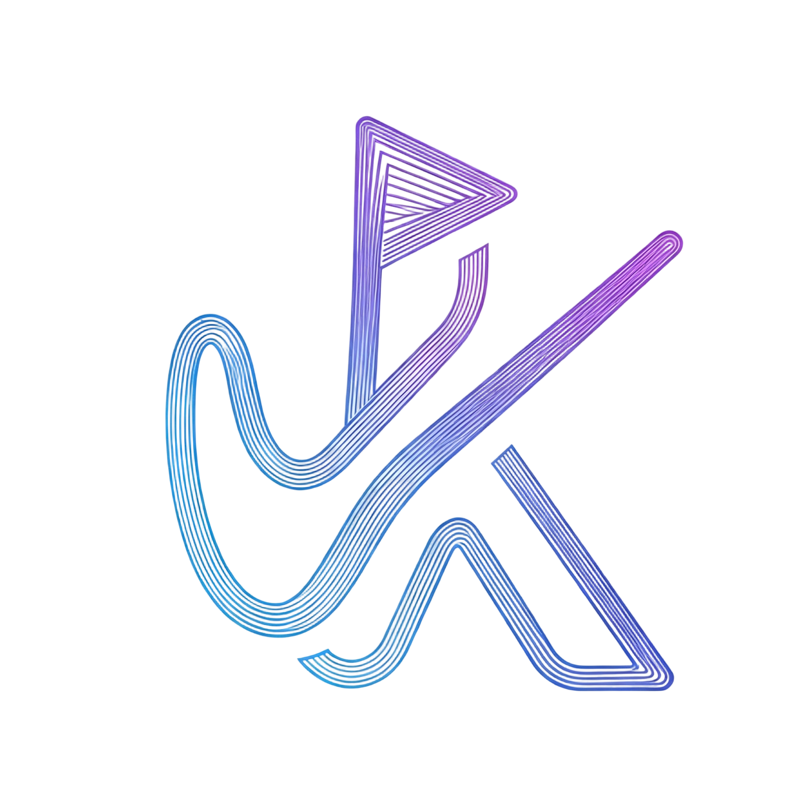

# KodakTV

<div align="center">
  
</div>

> KodakTV is a cross‑platform, ready‑to‑run video aggregation player built with Next.js 14, Tailwind CSS, and TypeScript. It supports multi‑source search, in‑browser playback, favorites/progress sync, and both local or cloud storage.

---

## Features

- Multi‑source aggregation search
- Rich detail page (episodes, cast, year, synopsis)
- Smooth web playback (ArtPlayer + HLS.js)
- Favorites and Continue Watching with optional Redis/D1/Upstash storage
- PWA support (installable, offline cache)
- Responsive layout (desktop sidebar, mobile bottom nav)
- Modern UI with glassmorphism and pill corners

## Quick Start

### Local development

- Install: `pnpm install`
- Start dev server: `pnpm dev`
- Open: `http://localhost:3000/` (or fallback port if busy)

Optional envs:
- `NEXT_PUBLIC_SITE_NAME` – site name (default: KodakTV)
- `PASSWORD` – admin password (recommended when not using localstorage)

### One‑command Docker

```bash
docker pull ghcr.io/lunatechlab/moontv:latest
docker run -d --name kodaktv -p 3000:3000 \
  -e PASSWORD=your_password ghcr.io/lunatechlab/moontv:latest
```

Open `http://<your-server-ip>:3000`.

### Vercel (one‑shot)

1. Fork this repo to your GitHub.
2. On Vercel → Add New Project → Import the fork.
3. Set env `PASSWORD=your_password` (and `NEXT_PUBLIC_SITE_NAME` if needed).
4. Deploy. Subsequent pushes to `main` will auto‑rebuild.

For Upstash Redis: set `NEXT_PUBLIC_STORAGE_TYPE=upstash`, `UPSTASH_URL`, `UPSTASH_TOKEN`, and `USERNAME`/`PASSWORD`.

## Configuration

All customizable options live in `config.json` (cache time, API sites, custom categories). The service reads it at startup; rebuild is not required.

## Contributing

- Fork and create feature branches from `kotelya-import` or your working branch.
- Use Conventional Commits style, e.g. `feat(ui): add BrandPill to search page`.
- Keep changes focused, avoid unrelated refactors.
- Run locally (`pnpm dev`) and verify no major runtime errors.
- If adding APIs or storage types, include minimal docs/tests.
- Open a Pull Request with a clear description and screenshots for UI changes.

### Coding guidelines

- TypeScript preferred, avoid one‑letter variable names.
- Follow existing code style; don’t introduce formatters unless project‑wide.
- Fix issues at root cause rather than patching symptoms.

## Release Notes

This project follows semantic versioning. Recent notable updates:

- Glassmorphism bottom nav and unified pill‑shaped corners
- Reusable `BrandPill` component used across Home/Search/Play/Admin/Warning
- Home: new Hot Anime section using Douban list API with tag fallback
- Login: improved multi‑user experience with gradient brand label

For a detailed history, see `CHANGELOG`.

## License

MIT